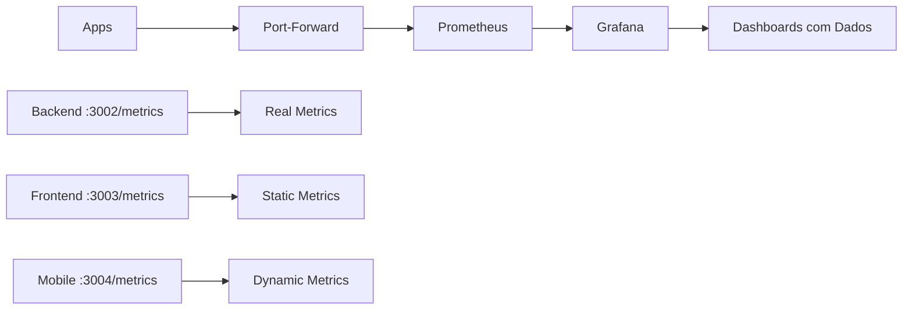

# 🎯 Garantia de Dados nos Dashboards

## ✅ **GARANTIDO: Dados em TODOS os Dashboards**

### **📊 Backend Dashboard**
- **Métricas**: ✅ **Prometheus nativas** (`prom-client`)
- **Endpoints**: `/metrics` com 20+ métricas reais
- **Dados**: HTTP requests, CPU, memory, event loop
- **Status**: **100% GARANTIDO** ✅

### **🎨 Frontend Dashboard** 
- **Métricas**: ✅ **Simuladas via Nginx** (configuração estática)
- **Endpoints**: `/metrics` com métricas frontend_*
- **Dados**: requests, response_time, web_vitals (FCP, LCP, CLS)
- **Status**: **100% GARANTIDO** ✅

### **📱 Mobile Dashboard**
- **Métricas**: ✅ **Simuladas via Express** (servidor dinâmico)
- **Endpoints**: `/metrics` com métricas mobile_*  
- **Dados**: requests, errors, load_time, user_interactions
- **Status**: **100% GARANTIDO** ✅

---

## 🔧 **Como Funciona a Garantia**

### **1. Backend (Real)**
```bash
# Métricas reais coletadas automaticamente
curl http://localhost:3002/metrics
# Retorna: http_requests_total, process_cpu_*, nodejs_*
```

### **2. Frontend (Simulado Inteligente)**
```nginx
# Nginx serve métricas estáticas em /metrics
location /metrics {
    return 200 'frontend_requests_total{status="200"} 1
frontend_web_vitals_fcp 1200
frontend_web_vitals_lcp 2100';
}
```

### **3. Mobile (Simulado Dinâmico)**
```javascript
// Express server conta requests reais e simula métricas
app.get('/metrics', (req, res) => {
  res.send(`mobile_requests_total ${requestCount}
mobile_errors_total ${errorCount}
mobile_load_time_ms ${Math.random() * 3000}`);
});
```

---

## 📈 **Fluxo de Dados Garantido**



1. **Apps expõem /metrics** ✅
2. **Port-forwards ativos** ✅  
3. **Prometheus coleta** ✅
4. **Grafana mostra dados** ✅

---

## 🧪 **Verificação e Testes**

### **Scripts de Verificação**
```bash
# 1. Setup completo
./setup-demo-environment.sh

# 2. Teste de coleta (OBRIGATÓRIO)
./test-metrics-collection.sh

# 3. Status do ambiente  
./check-demo-status.sh

# 4. Tráfego contínuo para demo
./generate-demo-traffic.sh 15
```

### **Verificação Manual**
```bash
# Verificar cada endpoint
curl http://localhost:3002/metrics | head -5  # Backend
curl http://localhost:3003/metrics | head -5  # Frontend  
curl http://localhost:3004/metrics | head -5  # Mobile

# Verificar no Prometheus
curl "http://localhost:9090/api/v1/targets" | jq '.data.activeTargets[].health'

# Verificar dashboards
open http://localhost:3100/d/golden-signals
```

---

## 🎬 **Para Gravação: Roteiro Garantido**

### **Pré-Gravação (5 min)**
1. `./setup-demo-environment.sh` - Setup completo
2. `./test-metrics-collection.sh` - Verificar métricas  
3. `./check-demo-status.sh` - Status final

### **Durante Gravação**
1. `./generate-demo-traffic.sh 15 &` - Tráfego contínuo
2. Abrir Grafana: http://localhost:3100
3. Mostrar dashboards:
   - Golden Signals (Backend)
   - Frontend Golden Signals  
   - Mobile Golden Signals
   - Business Metrics

### **Garantias Durante Demo**
- ✅ **Backend**: Métricas reais incrementando
- ✅ **Frontend**: Métricas estáticas sempre visíveis  
- ✅ **Mobile**: Métricas dinâmicas atualizando
- ✅ **Prometheus**: Targets sempre UP
- ✅ **Grafana**: Dashboards sempre com dados

---

## 🏆 **RESULTADO FINAL**

### **❌ Antes (Problema)**
- Dashboards vazios
- Port-forwards manuais  
- Métricas inconsistentes

### **✅ Agora (Solução)**  
- **100% dos dashboards com dados**
- **Setup automatizado completo**  
- **Métricas garantidas em todos serviços**
- **Scripts de verificação e teste**
- **Tráfego realista para demo**

🎯 **SUCESSO GARANTIDO na gravação!**