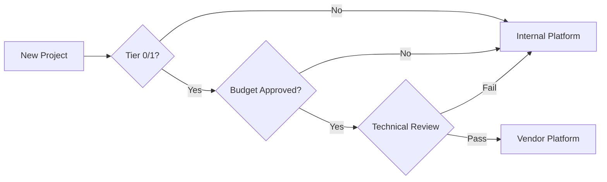

# Governance and Standards - Observability Platform

## 1. Platform Decision Framework

### 1.1 Decision Matrix for New Projects

Use this matrix to determine which observability platform to adopt:

| Factor | Weight | Internal Platform | Dynatrace | NewRelic |
|--------|--------|------------------|-----------|----------|
| **Cost** | 25% |  Low (<$1k/month) |  High ($10k-50k) |  Medium ($5k-30k) |
| **Criticality** | 30% |  Low-Medium |  High |  Medium-High |
| **Compliance** | 20% |  Full control |  Certified |  Certified |
| **Customization** | 15% |  High |  Low |  Medium |
| **Support** | 10% | Team hours | 24x7 Vendor | 24x7 Vendor |

### 1.2 Default Choice: Internal Platform (OpenTelemetry)

**Unless explicitly justified, ALL new projects must use the internal platform.**

#### Justification Required For Vendor Tools:
1. Business criticality (Tier 0/1 services only)
2. Regulatory requirements (specific compliance needs)
3. Executive approval
4. Budget allocation confirmed

#### Approval Process:


### 1.3 Migration Path for Existing Projects

**Target: 90% on internal platform within 12 months**

| Current | Q1 2026 | Q2 2026 | Q3 2026 | Q4 2026 |
|---------|---------|---------|---------|---------|
| Internal: 30% | 40% | 55% | 70% | 90% |
| Dynatrace: 60% | 50% | 35% | 20% | 8% |
| NewRelic: 10% | 10% | 10% | 10% | 2% |

**Prioritization:**
1. Non-production environments first
2. Low criticality services (Tier 3-4)
3. Projects with no vendor-specific features
4. Cost optimization opportunities

---

## 2. OpenTelemetry Standards

### 2.1 Mandatory Requirements

ALL applications MUST implement:

#### Traces
-  100% of HTTP/gRPC requests instrumented
-  Semantic conventions v1.21+ (https://opentelemetry.io/docs/specs/semconv/)
-  Context propagation (W3C Trace Context)
-  Error tracking with stack traces
-  Custom spans for critical business logic

#### Metrics
-  RED metrics (Rate, Errors, Duration)
-  USE metrics for resources (Utilization, Saturation, Errors)
-  Business metrics (transactions, revenue, etc.)
-  Runtime metrics (GC, memory, threads)
-  Prometheus exposition format on `/metrics`

#### Logs
-  Structured JSON format
-  Trace context correlation (trace_id, span_id)
-  Consistent fields: timestamp, level, message, service, team
-  No PII in logs (see Section 3)

### 2.2 Instrumentation Levels

| Level | Description | When to Use |
|-------|-------------|-------------|
| **Auto** | Zero-code instrumentation | Default for all services |
| **Semi-Auto** | Auto + custom spans | When business logic needs tracking |
| **Manual** | Full control | Complex workflows, performance tuning |

**Recommendation: Start with Auto, add custom spans as needed**

### 2.3 SDK Configuration Template

```yaml
# otel-sdk-config.yaml
resource:
  attributes:
    service.name: ${SERVICE_NAME}
    service.version: ${VERSION}
    service.namespace: ${NAMESPACE}
    deployment.environment: ${ENVIRONMENT}
    team.name: ${TEAM}
    cost.center: ${COST_CENTER}

exporters:
  otlp:
    endpoint: otel-collector.${NAMESPACE}.svc:4317
    protocol: grpc

processors:
  batch:
    timeout: 10s
  
  resource:
    attributes:
      - key: k8s.pod.name
        value: ${POD_NAME}
        action: upsert

sampling:
  parent_based:
    root:
      always_on: false
      probabilistic:
        sampling_percentage: 10  # Adjust per service criticality
```

### 2.4 Quality Gates

Before deploying to production:

- [ ] Traces viewable in Grafana/Jaeger
- [ ] Metrics scraped successfully (check ServiceMonitor)
- [ ] Logs properly formatted and correlated
- [ ] No PII detected in telemetry
- [ ] Cost estimation within budget
- [ ] SLO/SLA defined and tracked

---

## 3. Data Sensitivity & Compliance

### 3.1 PII Classification

| Category | Examples | Action |
|----------|----------|--------|
| **Level 1 - Critical** | SSN, Credit Card, Password |  BLOCK (never log) |
| **Level 2 - High** | Email, Phone, CPF/CNPJ, IP |  MASK (automatic) |
| **Level 3 - Medium** | Name, Address, User ID |  PSEUDONYMIZE (hash) |
| **Level 4 - Low** | Aggregate data, counts |  ALLOW |

### 3.2 Masking Rules (OTel Transform Processor)

Automatically applied at gateway level:

```yaml
processors:
  transform/pii:
    log_statements:
      - context: log
        statements:
          # Email → ***EMAIL***
          - replace_pattern(body, "\\b[A-Za-z0-9._%+-]+@[A-Za-z0-9.-]+\\.[A-Z|a-z]{2,}\\b", "***EMAIL***")
          
          # CPF → ***CPF***
          - replace_pattern(body, "\\b\\d{3}\\.\\d{3}\\.\\d{3}-\\d{2}\\b", "***CPF***")
          
          # CNPJ → ***CNPJ***
          - replace_pattern(body, "\\b\\d{2}\\.\\d{3}\\.\\d{3}/\\d{4}-\\d{2}\\b", "***CNPJ***")
          
          # Credit Card → ***CARD***
          - replace_pattern(body, "\\b\\d{4}[\\s-]?\\d{4}[\\s-]?\\d{4}[\\s-]?\\d{4}\\b", "***CARD***")
          
          # Phone → ***PHONE***
          - replace_pattern(body, "\\b\\(?\\d{2}\\)?[\\s-]?\\d{4,5}[\\s-]?\\d{4}\\b", "***PHONE***")
          
          # Private IP → ***IP***
          - replace_pattern(body, "\\b(10|172\\.(1[6-9]|2[0-9]|3[0-1])|192\\.168)\\.\\d{1,3}\\.\\d{1,3}\\b", "***IP***")
    
    trace_statements:
      - context: span
        statements:
          # Sensitive headers
          - set(attributes["http.request.header.authorization"], "***REDACTED***") where attributes["http.request.header.authorization"] != nil
          - set(attributes["http.request.header.cookie"], "***REDACTED***") where attributes["http.request.header.cookie"] != nil
          - set(attributes["http.request.header.x-api-key"], "***REDACTED***") where attributes["http.request.header.x-api-key"] != nil
          
          # Query parameters with sensitive names
          - replace_pattern(attributes["http.url"], "([?&])(password|token|secret|apikey)=[^&]*", "$1$2=***REDACTED***")
```

### 3.3 Retention Policies

| Data Type | Hot (Fast Query) | Warm (Archive) | Cold (Compliance) |
|-----------|------------------|----------------|-------------------|
| **Logs** | 7 days (OpenSearch) | 90 days (S3 Standard) | 10 years (S3 Glacier Deep) |
| **Metrics** | 30 days (Victoria) | 1 year (Victoria LTS) | 10 years (S3 Parquet) |
| **Traces** | 7 days (Jaeger) | 30 days (Tempo) | 1 year (S3) |

**Exceptions:**
- Production incidents: Extended to 90 days hot
- Audit trails: Permanent retention
- PCI/SOX data: Per regulatory requirements

### 3.4 Access Control (RBAC)

```yaml
# OpenSearch/Grafana Roles
roles:
  - name: team-viewer
    permissions:
      - read_own_team_data
      - create_dashboards
      - save_queries
  
  - name: team-admin
    permissions:
      - read_own_team_data
      - write_own_team_data
      - manage_alerts
      - manage_dashboards
  
  - name: platform-admin
    permissions:
      - read_all_data
      - write_all_data
      - manage_infrastructure
      - export_data
  
  - name: compliance-auditor
    permissions:
      - read_all_data
      - export_audit_logs
      - no_pii_access  # PII remains masked even for auditors
```

### 3.5 Encryption

- **In Transit:** TLS 1.3+ for all connections
- **At Rest:** 
  - S3: SSE-S3 (AES-256)
  - OpenSearch: Encryption enabled
  - Victoria Metrics: Volume encryption (EBS)

### 3.6 Audit Trail

All access to observability data is logged:

```json
{
  "timestamp": "2026-01-15T10:30:00Z",
  "user": "alice@company.com",
  "action": "query",
  "resource": "logs",
  "namespace": "payments",
  "query": "SELECT * FROM logs WHERE level='ERROR'",
  "result_count": 42,
  "ip": "10.0.1.5",
  "user_agent": "Grafana/10.0"
}
```

**Retention: 7 years (regulatory)**

---

## 4. Engineering Best Practices

### 4.1 Sampling Strategy

Not all telemetry is equal. Optimize cost vs value:

#### Traces
- **Errors:** 100% (always sample failures)
- **Slow requests (>1s):** 100%
- **Success (<1s):** 1-10% (tail-based sampling)

#### Logs
- **ERROR/FATAL:** 100%
- **WARN:** 50%
- **INFO:** 10%
- **DEBUG:** 1% (or 0% in production)

#### Metrics
- **High cardinality (user_id):** Aggregate only
- **Low cardinality (status_code):** Full resolution
- **Downsampling:** After 30 days (1m → 5m → 1h)

### 4.2 Performance Budget

Per service, per day:

| Metric | Budget | Action if Exceeded |
|--------|--------|--------------------|
| Logs | <10 GB | Reduce verbosity, increase sampling |
| Traces | <1M spans | Increase sampling percentage |
| Metrics | <10k series | Remove high-cardinality labels |
| Cost | <$50 | Review with team lead |

### 4.3 Naming Conventions

#### Metrics
```
{namespace}_{subsystem}_{metric}_{unit}

Examples:
- payment_api_requests_total
- payment_api_request_duration_seconds
- payment_db_connections_active
```

#### Trace Spans
```
{operation_type}.{resource}

Examples:
- http.server.request
- db.query.select
- message.queue.publish
```

#### Logs
```json
{
  "timestamp": "2026-01-15T10:30:00Z",
  "level": "ERROR",
  "message": "Payment processing failed",
  "service": "payment-api",
  "team": "payments",
  "trace_id": "abc123",
  "span_id": "def456",
  "error": {
    "type": "PaymentGatewayTimeout",
    "message": "Gateway timeout after 30s",
    "stack": "..."
  }
}
```

### 4.4 Testing Observability

Include in CI/CD:

```bash
# Test 1: Verify traces are exported
curl http://localhost:4318/v1/traces -X POST -d @test-trace.json
kubectl logs -n observability otel-collector | grep "traces exported"

# Test 2: Verify metrics endpoint
curl http://localhost:9464/metrics | grep "^payment_api_requests_total"

# Test 3: Verify log format
echo '{"level":"INFO","message":"test"}' | \
  jq -e '.timestamp and .level and .message'

# Test 4: PII masking
echo '{"message":"User email@example.com"}' | \
  otel-processor | grep "***EMAIL***"
```

### 4.5 Incident Response

When observability fails:

1. **Fallback:** Logs to stdout (kubectl logs)
2. **Alert:** Platform team (#platform-observability)
3. **Temporary:** Direct export to CloudWatch
4. **Postmortem:** Required for all outages >30min

---

## 5. Enforcement

### 5.1 Automated Checks

**Pre-deployment (CI/CD):**
- [ ] OTEL SDK configured
- [ ] Metrics endpoint responds
- [ ] No secrets in logs
- [ ] Namespace labels present
- [ ] Cost estimate <$50/day

**Runtime (Platform):**
- [ ] Telemetry received within 5 minutes
- [ ] PII masking active
- [ ] Within performance budget
- [ ] Alerts configured

### 5.2 Non-Compliance Actions

| Violation | Severity | Action |
|-----------|----------|--------|
| PII leaked |  Critical | Immediate alert, data purge, incident |
| No instrumentation | 🟠 High | Block production deploy |
| Wrong vendor (unapproved) | 🟠 High | Escalate to leadership |
| Over budget | 🟡 Medium | Warning, optimization required |
| Missing tags | 🟢 Low | Auto-tag with defaults |

### 5.3 Quarterly Reviews

Every quarter, platform team reviews:
1. Adoption metrics (% on standard platform)
2. Cost trends (per team, per cluster)
3. Compliance violations (PII leaks, etc.)
4. Performance (p99 latency, data loss rate)
5. Satisfaction (NPS survey)

**Report shared with leadership + all teams**

---

## 6. Support & Resources

### 6.1 Channels
- **Slack:** #platform-observability (24x7 monitoring)
- **Email:** platform-team@company.com
- **On-call:** PagerDuty (P1 incidents only)

### 6.2 Documentation
- **Wiki:** https://wiki.company.com/observability
- **Runbooks:** https://runbooks.company.com/observability
- **Training:** Monthly "Observability 101" sessions

### 6.3 Office Hours
- **Weekly:** Wednesdays 2-4 PM (Platform team available)
- **Monthly:** Architecture review (new projects)

---

## Approval

| Role | Name | Date | Signature |
|------|------|------|-----------|
| Platform Lead | | | |
| Security Lead | | | |
| FinOps Lead | | | |
| CTO | | | |

**Version:** 1.0  
**Effective Date:** 2026-01-15  
**Review Date:** 2026-04-15 (quarterly)
